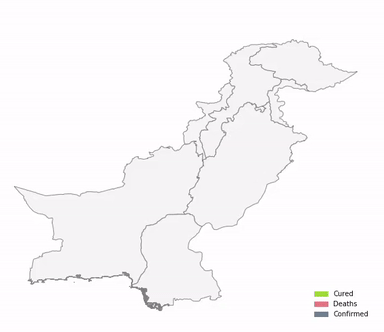
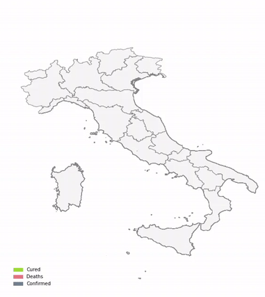

**In December 2019, there was a cluster of pneumonia cases in China. 
An investigation led to the discovery that it was caused by a previously 
unknown virus now named the Corona Virus/ Covid-19. It has been proven to 
excessively target the BAME community due to frequent physical contact and has 
become pervasive.**

Dealing with the unforeseen challenges arisen by the COVID-19, 
the pandemic has taken a significant toll on people all across the world. 
Countries are severely getting affected and populations are stricken substantially. 
It has sternly taken a toll on the economies, as well. 

Keeping in view the rapid pace of the viral spread, the need of the time is an 
effective resource planning strategy. The fluctuating rate of the fatality over time due to 
inefficacious inhibitory proceedings would result in unguaranteed security of human life.

Through this Hack, we aim to use technology to predict the future of the global pandemic and act accordingly to 
make the prevention affective.

---

Firstly, we took up the Challenge 2 where required to predict the number of COVID-19 cases and 
death cases in 5 countries of Africa.

### Problem Statement

_Predicting_ - Effective resource planning and strategising relies on knowledge of the velocity and
veracity of viral spread. Subtle differences between nations have been evident in the changes between
the death rate rises and falls over time allowing for targeted approaches to maximise lives saved.
Effective planning is most important where resources are naturally the scarcest.
Predict the future cases and death rates for 5 countries in Africa.
Create a visualisation and a short blog explaining your modelling steps and results.

We have chosen 5 African countries namely South Africa, Algeria, Egypt, Kenya and Nigeria. 
We will predict the future 20 day cases and death rates of these 5 countries of Africa. 
We will be explaining the modeling steps and results by creating visualiztions.

### Prediction Methodology

We chose to use Facebook's **Prophet** Bayesian Prediction Library for our Regression analysis purposes. 
Prophet is a procedure for forecasting time series data based on an additive model where non-linear trends are fit with yearly, weekly, and daily seasonality, plus holiday effects. It works best with time series that have strong seasonal effects and several seasons of historical data. 
Prophet is robust to missing data and shifts in the trend, and typically handles outliers well.
The Prophet system can usually be used off the shelf for Time Series analysis but also offers powerful tweaking opportunities to better represent the data we feed it.

#### Modelling Decisions
Instead of only relying on past cases to predict future cases, we try to take into consideration other factors that might influence of the model's decision to predict future cases.
We proceeded to understand how the change was for the number of reported cases and the number of reported deaths between every consequtive day.
This trend analysis of **the percentage of change** in cases and the **difference in deaths** between two consequtive days was used as an **additional regressor** to our baseline prediciton model whihc yielded better predictive results to match the validation data.

#### South Africa

The COVID-19 pandemic in South Africa is part of the ongoing pandemic. On 5 March 2020,the spread of the virus commenced in South Africa, with the first known patient.The first death to have occurred from the disease was reported on 27 March 2020.

Currently, there are 2,873,163 tests conducted, 471,123 Positive Cases Identified, 297,967 Recovered and 7,497 Deaths. (SA Corona Virus Online Portal, n.d).

##### Predictive Graphs

Predictions for the change in consecutive cases and deaths

Predictions for the possible future cases and deaths 

#### Algeria

On 25 February, Algeria laboratory-confirmed its first case of severe acute respiratory syndrome coronavirus 2 (SARS-CoV-2), an Italian man who arrived on 17 February;on 28 February, Algeria deported him back to Italy, via a special flight from Hassi Messaoud Airport where he was subject to quarantine.( africatimes.com. 25 February 2020)

Currently, there are 29229 Cases, 19592 Recovered and 1186 Deaths In Algeria.(“Covid-19 Algeria”, n.d.)

##### Predictive Graphs

Predictions for the change in consecutive cases and deaths
 

Predictions for the possible future cases and deaths 

#### Egypt

Egypt's health ministry announced the first case in the country at Cairo International Airport involving a Chinese national on 14 February. (Egypt Today, 14 February 2020)

##### Predictive Graphs

Predictions for the change in consecutive cases and deaths

Predictions for the possible future cases and deaths 

#### Kenya

The COVID-19 pandemic reached Kenya on On 13 March, the first case in Kenya, a 27-year-old Kenyan woman who traveled from the US via London, was confirmed. (Daily Nation, 13 March 2020). According to the data we accumulated and scrutinized, we came to the conclusion that the epidemic situation has been proliferating at a rapid pace in Kenya. Moreover, there have been complications in the prevention of the virus as the socio-economic position of the country is not very developed. However, Kenya had endorsed cashless payments in order to prevent the transmission of the virus by banknotes and a partial lockdown had also been imposed. Adding in, despite of the lockdown and the prevention measures, some local residents hold the firm conviction that the virus does not exist and is not more than a mere hoax. This ignorance has led to a major increase in the number of cases, as well. This intimates that. The first case of Kenya was reported in the capital city Nairobi in March. 
There has been an increase of 18,000 cases since then.

##### Predictive Graphs

Predictions for the change in consecutive cases and deaths

Predictions for the possible future cases and deaths 

#### Nigeria

The COVID-19 pandemic in Nigeria is part of the worldwide pandemic of coronavirus disease 2019 (COVID-19) caused by severe acute respiratory syndrome coronavirus 2 (SARS-CoV-2). The first confirmed case in Nigeria was announced on 27 February 2020, when an Italian citizen in Lagos tested positive for the virus.(ncdc.gov.ng, n.d.)

Currently, there are 42,208 Confirmed Cases, 22,331 Active Cases, 19,004 Discharged Cases, and 873 Deaths. (covid19.ncdc.gov.ng, n.d.)

##### Predictive Graphs

Predictions for the change in consecutive cases and deaths

Predictions for the possible future cases and deaths 

As a epilogue, it appears that all countries that have implemented a lockdown are now struggling to work out an exit strategy. The World Health Organization (WHO) estimates the fatality of up to 190,000 people if containment measures are not taken in Africa. The transmission could reach a number of up to 44 million, if not dealt with efficiently. In addition, the current available medical capacity could possibly be surpassed by the number of cases that demand urgent hospitalization. The insufficient health capacities would be strained.

---

We decided to also tackle Challenge 1 which involved understanding from the data how the pandemic progresses and how this analysis could be used in the 
future to better handle such a situation, through the stories of 3 countries. We chose to do this to show how the pandemic slowly spreaded across India, Pakistan and Italy.

### Problem Statement

_Explaining_ - This virus becomes endemic through frequent person-to-person contact and has
been proven to disproportionately target the BAME community.
Seeing the spread of this virus from the original outbreak offers the potential to assess
when to close borders, but also to plan for future outbreak mitigation without unnecessarily
adverse economic implications. Tell the story of COVID-19from the view of developing countries.
Produce a 5-minute video explaining the outbreak using at most 3 different visualisations.

### India

In India, the first case originated from Kerala on the 30 Jan 2020. The following state which got affected was Jammu & Kashmir, followed by Uttar Pradesh, then Chhattisgarh, Delhi, Goa, Gujarat, Haryana, Himachal Pradesh, so on and so forth.

The first nation-wide lockdown which took place from 26 March to 14 April which helped to prevent the rapid spread which was effective and kept the number of cases under control. However after the lockdown ended, the virus started to spread wildly, leading to a rapid increase in the number of new cases. 

After researching we found that, the potential clusters and rapid spreading took place in religious tourism places such as Agra; religious congregations such as the one in Delhi and weddings.

We believe the lack of awareness has resulted to this. Where people have not been warned enough about the consequences COVID-19. In such cases, the government needs to bring up stricter rules and effective ways of educating their people.

---

### Pakistan

Covid-19's first two cases in Pakistan emerged on 26 February, one reported in Karachi and the other in the capital city Islamabad. By 18th March, all provinces had reported covid cases. The transmission hotspots of the virus were mainly based in Punjab and the Sindh province. The first death of the covid 19 was reported in Sindh on 20th March. By the end of March, a lockdown was imposed in most of the provinces. Talking about the economy, Pakistan had lost Rs 2.5 trillion because of the pandemic and the mango exports were also declined due to the pandemic. The virus has also infected 500 Pakistani healthcare workers. Moreover, 12.3 million to 18.5 million people became jobless due to the pandemic. A total of 5,924 deaths have been reported till now. 
The recovered cases were a total of 246,131.

---

### Italy

The virus was first confirmed to have spread to Itlay on 31 January 2020, when two Chinese tourists in Rome tested positive for the virus.

Three weeks into the lockdown, its effects began to show.

On 1 March, the Council of Ministers approved a declaration to organise the containment of the outbreak. In the declaration, the Italian national territory was divided into three areas

Subsequent to the imposing of the national lockdown, there were protests in some Italian prisons.

The Lombardy region has a higher number of intensive care and resuscitation beds compared to southern Italy; unfortunately, these places are fast running out of hospital beds and facing challenges in the provision of primary care for conditions other than COVID-19, necessitating the transfer of numerous patients to other regions. The situation would probably have been considerably worse if the regions of Southern Italy had the highest number of COVID-19 cases.

These confirm the fact that we are facing a problem.

